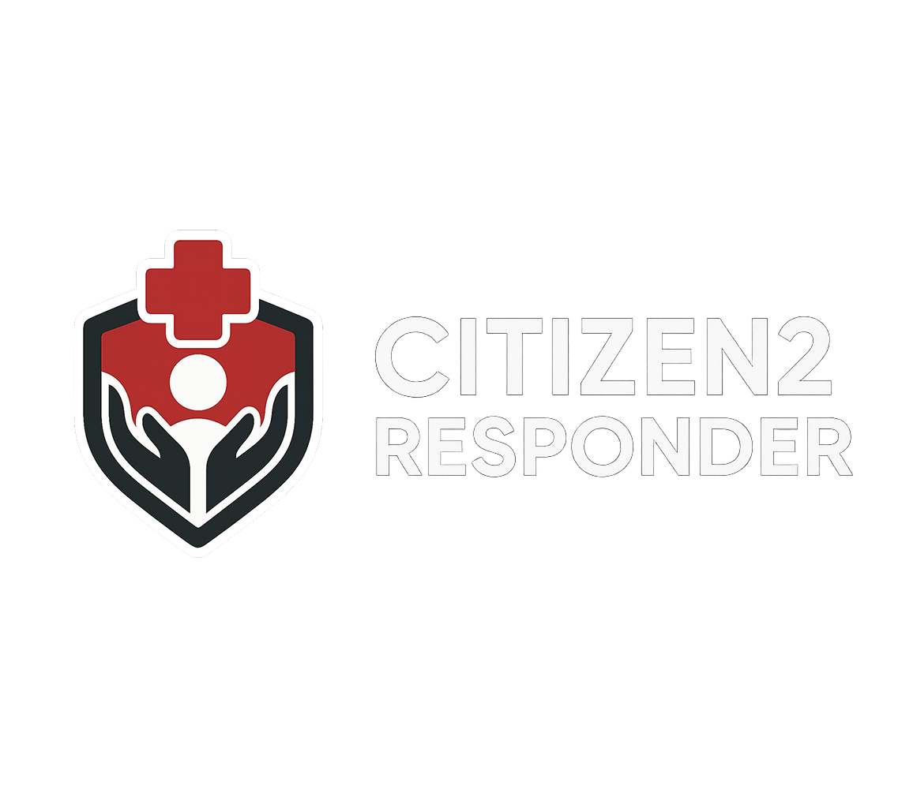
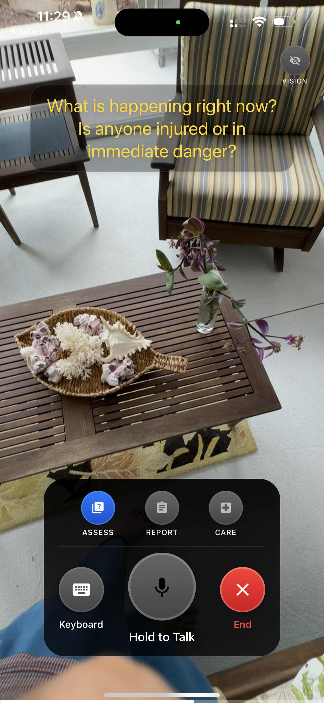
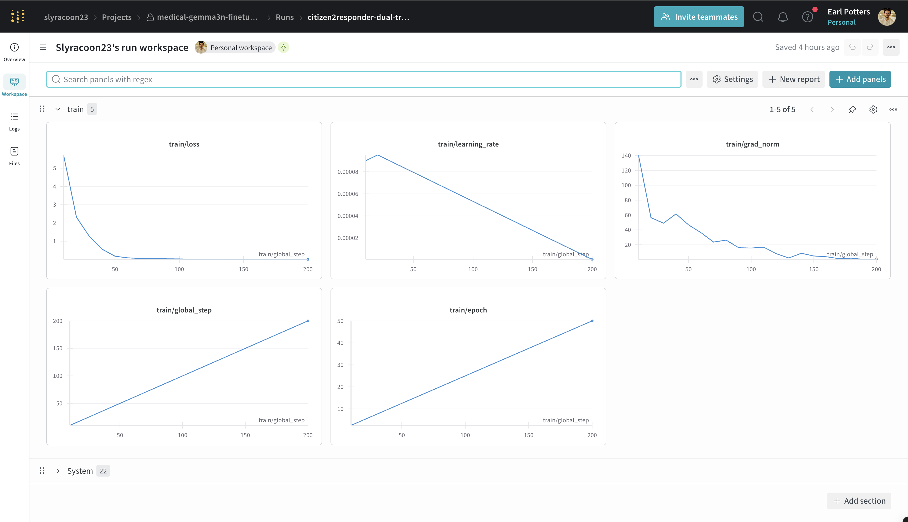
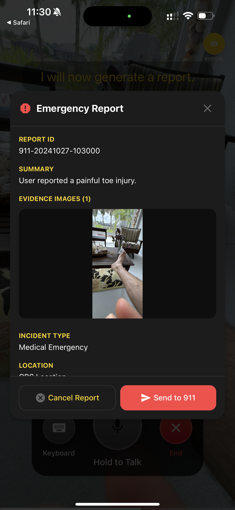
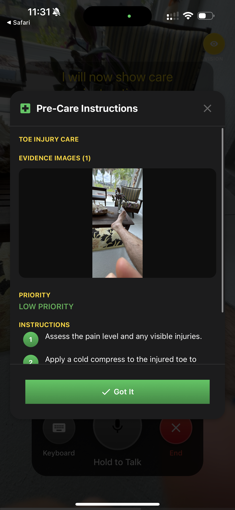

<div align="center">
  
  
  # Citizen2Responder App
  
  *A cutting-edge emergency response and medical assistance application that combines AI-powered real-time video communication with intelligent assessment tools. Built with React Native and Expo, featuring local AI processing with cloud fallback for optimal performance and privacy.*
</div>

## 🚨 Overview

The Citizen2Responder App is designed to assist emergency responders, medical professionals, and individuals during critical situations. It provides AI-guided assessments, automated report generation, and real-time care instructions through an intuitive video calling interface.

## 🎥 App Preview

<div align="center">
  <a href="https://youtube.com/shorts/sZiRVKiMAcw?feature=share">
    
  </a>
  
  **[📺 Watch Demo Video](https://youtube.com/shorts/sZiRVKiMAcw?feature=share)**
  
  *See the app in action - AI-powered emergency response tools, real-time assessment, and care instructions*
</div>

## 📱 Try the App

<div align="center">
  
  
  *Scan the QR code with Expo Go or use the link below*
</div>

**[🚀 Live Demo on Expo](https://expo.dev/preview/update?message=add+precare&updateRuntimeVersion=1.0.0&createdAt=2025-07-31T15%3A20%3A58.533Z&slug=exp&projectId=bb716e6f-12c3-4027-8469-842404ef30f5&group=a46ec03a-d9bc-40c8-affe-95b4aab85a12)**

Experience the app instantly using the Expo Go app on your mobile device. Scan the QR code or open the link above to test all features including the AI assessment tools, emergency reporting, and care instructions.

### Key Capabilities

- **AI-Powered Emergency Assessment** - Intelligent questioning and situation analysis
- **Automated Report Generation** - Comprehensive emergency documentation
- **Real-time Care Instructions** - AI-generated medical guidance and protocols
- **Vision Analysis** - Image and video analysis for medical situations
- **Local AI Processing** - Privacy-focused on-device AI with cloud fallback
- **Professional Communication** - Video calling optimized for emergency scenarios

## 🧠 AI Technology

### Local AI Processing
- **Model**: Fine-tuned Medical Gemma 3N ([HuggingFace](https://huggingface.co/Slyracoon23/medical-gemma3n-emergency-response))
- **Framework**: llama.rn for on-device inference
- **Benefits**: Low latency, privacy protection, offline capability
- **Use Cases**: Text conversations, assessments, report generation

### Cloud AI Integration
- **Model**: Gemini Flash 1.5 8B via OpenRouter
- **Purpose**: Vision processing and image analysis
- **Features**: Medical image interpretation, visual assessment support

> **⚠️ Framework Limitation**: While Gemma-3n supports multimodal capabilities, llama.rn currently does not support vision and audio processing. This is a limitation of the mobile framework, not the underlying model. Therefore, we route vision and audio tasks to cloud-based models to provide complete functionality.

### Smart Routing
The app intelligently routes requests based on capability requirements:
- **Text-only interactions** → Local Gemma-3n model
- **Vision/image analysis** → Cloud Gemini Flash model
- **Automatic fallback** → Cloud processing if local model fails

### 🏥 Medical Fine-tuning
- **Specialized Training**: Fine-tuned Gemma 3N for emergency response scenarios
- **Dual-mode Operation**: Natural conversation guidance + structured tool calling for EMTs
- **Emergency Coverage**: 20+ categories including cardiac, respiratory, trauma, and neurological emergencies
- **Mobile Optimized**: GGUF quantization for efficient on-device deployment  
- **Development Tools**: Fine-tuning and model conversion scripts available in `finetuning/` directory

#### Training Dataset
Our medical training dataset was developed through real EMT field experience, featuring 40+ emergency scenarios across critical categories:
- **EMT-Validated**: All scenarios reviewed against actual emergency protocols
- **Dual-Mode Training**: Each scenario includes both conversational guidance and structured tool calling
- **Safety-First**: Responses prioritize patient safety and professional handoff protocols
- **Progressive Assessment**: Training examples demonstrate proper medical questioning sequences

<div align="center">
  
  <p><em>WandB Training Logs - Model fine-tuning metrics and performance tracking</em></p>
</div>

## 🎛️ Core Features

### Emergency Response Toggles

The app features three primary access modes accessible through intuitive toggle controls, plus vision capabilities:

#### ASSESS Mode
- **Purpose**: Guided emergency assessment
- **Function**: AI-driven questioning to evaluate situations
- **Icon**: Quiz/Question mark
- **Usage**: Activate to receive structured assessment questions

<div align="center">
  
  <p><em>Assess Mode - Initial emergency assessment with toggle controls</em></p>
</div>

#### REPORT Mode  
- **Purpose**: Automated emergency report generation
- **Function**: Creates comprehensive incident documentation
- **Icon**: Assignment/Document
- **Usage**: Generate detailed reports based on conversation history

<div align="center">
  
  <p><em>Report Mode - Emergency report generation with incident details</em></p>
</div>

#### CARE Mode
- **Purpose**: Real-time care instructions
- **Function**: Provides immediate medical guidance and protocols
- **Icon**: Hospital/Medical cross
- **Usage**: Access emergency care instructions and procedures

<div align="center">
  
  <p><em>Care Mode - Pre-care instructions with step-by-step guidance</em></p>
</div>

#### Vision Capabilities
The app includes AI-powered vision analysis for visual assessment support.

### Additional Controls
- **Camera Toggle**: Video feed control with permission management
- **Voice Toggle**: Audio recording and transcription
- **Keyboard Input**: Text-based communication option
- **Transcription**: Real-time speech-to-text conversion

## 🛠️ Technology Stack

### Frontend
- **React Native** - Cross-platform mobile development
- **Expo** - Development and deployment platform
- **TypeScript** - Type-safe development

### AI & ML
- **llama.rn** - Local AI inference library
- **Gemma-3n** - On-device language model
- **OpenRouter** - Cloud AI API gateway

## 📱 Setup Instructions

### Prerequisites
- Node.js 18+ 
- Expo CLI
- iOS Simulator or Android Emulator
- Physical device for optimal performance

### Installation

1. **Clone the repository**
   ```bash
   git clone <repository-url>
   cd relay-responder-app
   ```

2. **Install dependencies**
   ```bash
   npm install
   ```

3. **Configure Local AI Model**
   
   ⚠️ **IMPORTANT**: Configure the local model path in your `.env` file
   
   **Model Requirements:**
   - Download the Gemma-3n GGUF model file
   - Place it in an accessible directory on your development machine
   - Add the model path to your `.env` file

4. **Environment Setup**
   Create a `.env` file with required API keys and model configuration:
   ```env
   EXPO_PUBLIC_OPENROUTER_API_KEY=your_openrouter_api_key_here
   EXPO_PUBLIC_MODEL_PATH=/path/to/your/models/gemma-3n-E2B-it-Q4_K_M.gguf
   EXPO_PUBLIC_DEEPGRAM_PUBLIC_KEY=your_deepgram_api_key_here
   EXPO_PUBLIC_REPLICATE_API_KEY=your_replicate_api_key_here
   ```
   
   **Required API Keys:**
   - **Deepgram API Key**: Required for Speech-to-Text (STT) functionality
   - **Replicate API Key**: Required for Text-to-Speech (TTS) functionality

### Development

1. **Prebuild (first time only)**
   ```bash
   npm run prebuild
   ```

2. **Start development server**
   ```bash
   npm run start:dev
   ```

3. **Run on device**
   ```bash
   # iOS
   npm run ios:dev
   
   # Android  
   npm run android:dev
   ```

### Production Build

```bash
# iOS
npm run build:ios

# Android
npm run build:android
```


## 📋 Development Scripts

```bash
npm run start          # Standard Expo start
npm run start:dev      # Development client start  
npm run android:dev    # Android debug build
npm run ios:dev        # iOS debug build
npm run build:android  # Android production build
npm run build:ios      # iOS production build
npm run prebuild       # Clean prebuild
npm run lint           # Code linting
```

## 📄 License

This project is licensed under the MIT License - see the LICENSE file for details.

---

**⚠️ Emergency Disclaimer**: This application is designed to assist in emergency situations but should not replace professional medical advice or emergency services. Always contact appropriate emergency services (911, etc.) for immediate medical emergencies.