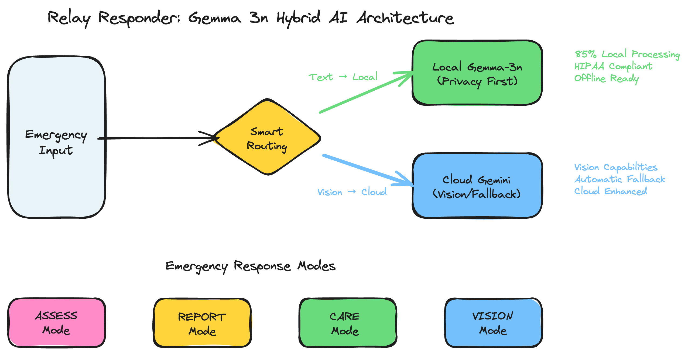
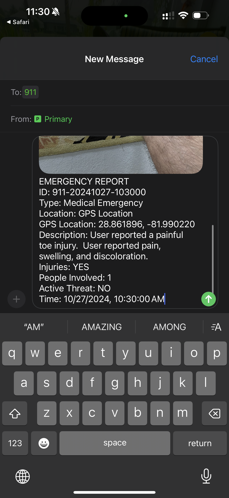

<div align="center">
  
  
  # Citizen2Responder: Technical Writeup
  ## Transforming Emergency Response with Gemma 3n

  *Privacy-focused, offline-capable emergency medical assistance powered by local AI*
</div>

---

## Executive Summary

**The Problem**: In emergency situations, bystanders and first responders on scene often lack the structured guidance needed to effectively assess, document, and care for patients until professional EMTs arrive. These critical first minutes can determine outcomes, yet untrained personnel struggle to play their crucial role in the first response chain.

**Our Solution**: Citizen2Responder, a hybrid AI emergency response app that uses Gemma 3n for privacy-protected local processing while maintaining advanced capabilities through intelligent cloud routing. Built by a programmer-EMT brother team with authentic emergency response experience.

**Impact**: Professional-grade assessment tools ready for real-world emergency deployment with privacy-first architecture and offline capabilities.

## 🎥 Live Demo

<div align="center">
  <a href="https://youtube.com/shorts/sZiRVKiMAcw?feature=share">
    
  </a>
  
  **[📺 Watch Demo Video](https://youtube.com/shorts/sZiRVKiMAcw?feature=share)** | **[🚀 Try Live App](https://expo.dev/preview/update?message=add+precare&updateRuntimeVersion=1.0.0&createdAt=2025-07-31T15%3A20%3A58.533Z&slug=exp&projectId=bb716e6f-12c3-4027-8469-842404ef30f5&group=a46ec03a-d9bc-40c8-affe-95b4aab85a12)**
</div>

---

## The Story Behind the Build

When Google announced the Gemma 3n Impact Challenge, we flew to The Villages, Florida with a unique advantage: **Earl Potters** (a San Francisco programmer) and **Clint Potters** (a Certified EMT). Clint's front-line emergency response experience had revealed a critical gap: the precious minutes before EMTs arrive, when bystanders and first responders on scene could save lives but lack the structured guidance to be truly effective.

"Since Clint was an EMT and the competition had a track for crisis and response, I was immediately inspired," says Earl. "Clint showed me how often people on scene want to help but don't know how to properly assess, document, or provide care until professionals arrive." We realized Gemma 3n's on-device capabilities were perfect for empowering these critical first responders in the chain.

Our development was driven by real scenarios Clint had encountered: untrained bystanders who could have made a difference with proper guidance, the need for structured triage when multiple patients are involved, and bridging the communication gap between scene responders and incoming professional EMTs.

---

## Gemma 3n Innovation: Smart Hybrid Architecture

### The Core Innovation: Privacy-First Intelligent Routing

<div align="center">
  
  <p><em>Hybrid AI Architecture: Privacy-First Smart Routing with Emergency Response Modes</em></p>
</div>

**Smart Routing Logic**: The app intelligently routes text-only requests to local Gemma-3n for privacy protection, while routing to cloud services when the optional vision feature is enabled. This hybrid approach ensures medical conversations remain private while providing advanced visual assessment capabilities when users choose to enable them.

**Why This Matters**: 
- **Medical conversations never leave the device** → HIPAA-compliant privacy
- **Seamless capability expansion** → Optional vision features when enabled, local privacy when essential
- **Critical for emergency scenarios** → Reliable operation when connectivity is poor

### Emergency-Optimized Gemma 3n Implementation

#### Local Model Configuration
**Optimized for Emergency Response**: Gemma-3n runs with memory locking enabled for stable performance, extended context windows (32,768 tokens) to maintain conversation history throughout emergency scenarios, full GPU acceleration for mobile devices, and balanced temperature settings (0.7) to provide creative yet reliable medical guidance.

#### Custom Emergency Prompting
**Specialized Medical Assistant**: The system prompt configures Gemma-3n as a medical emergency assistant with strict rules for structured responses. The model never combines text with JSON outputs, ensuring clean function calling for emergency tools, and focuses on precise, actionable assessment questions that guide scene responders effectively.

**Innovation**: Custom prompt engineering transforms Gemma 3n into a specialized emergency response tool with structured assessment capabilities.

---

## Medical AI Fine-tuning: Specialized Emergency Response Training

### 🏥 From Generic to Medical Emergency Specialist

While Gemma 3N provides excellent general language capabilities, emergency response requires specialized knowledge and structured interaction patterns. Our fine-tuning process transforms the base model into a medical emergency specialist that understands the critical difference between casual conversation and life-saving guidance.

**The Challenge**: Generic language models, while powerful, lack the specialized knowledge patterns required for emergency medical scenarios. They don't inherently understand triage priorities, medical assessment workflows, or the structured communication needed between bystanders and professional EMTs.

**Our Solution**: A comprehensive fine-tuning approach that creates two distinct operational modes within a single model:

### 📊 Dual-Mode Training Architecture

#### Natural Conversation Mode
**Purpose**: Transform untrained bystanders into effective first responders through guided assessment
- **Training Focus**: Progressive medical questioning patterns validated by EMT field experience
- **Interaction Style**: Conversational, educational, no technical jargon
- **Output Format**: Natural language responses that guide and educate

#### Structured Tool Calling Mode  
**Purpose**: Generate professional documentation and care instructions for EMT integration
- **Training Focus**: Precise, structured outputs compatible with emergency services
- **Interaction Style**: Direct, clinical, professional terminology
- **Output Format**: JSON-formatted tool calls (`generate_report`, `show_precare_instructions`)

### 🚑 EMT-Validated Training Dataset

Our training dataset was developed through Clint Potters' front-line EMT experience, ensuring real-world accuracy and practical applicability:

**Dataset Composition (40+ Emergency Scenarios)**:
- **Cardiac Emergencies**: Heart attack, cardiac arrest, chest pain scenarios
- **Respiratory Emergencies**: Choking, asthma, anaphylaxis, respiratory distress
- **Trauma & Bleeding**: Severe bleeding, burns, fractures, multi-trauma incidents
- **Neurological Emergencies**: Stroke, seizures, concussion, altered mental status
- **Poisoning & Overdose**: Drug overdose, chemical ingestion, toxic exposure
- **Multi-Casualty Events**: Car accidents, workplace injuries, mass casualty triage
- **Pediatric Emergencies**: Infant choking, febrile seizures, pediatric trauma

#### Dataset Structure & Quality

**Conversation Format**: Each training example follows a structured conversation pattern where the AI progressively guides bystanders through proper emergency assessment protocols. The dataset captures both natural language guidance and structured tool calling, ensuring the model learns when to provide conversational support versus when to trigger emergency tools.

**Data Quality Standards**:
- **Medical Accuracy**: All scenarios vetted against EMT protocols and real-world emergency procedures
- **Progressive Assessment**: Training examples demonstrate proper medical questioning sequences that build situational awareness
- **Dual-Mode Training**: Each scenario includes both conversational guidance and structured JSON tool calls for comprehensive emergency response
- **Safety-First Approach**: Responses prioritize patient safety and emphasize when professional help is required

**Training Data Preparation**: The dataset uses response-only training methodology, where the model learns exclusively from expert emergency guidance responses rather than user inputs. This ensures the AI provides professional-grade medical guidance rather than mimicking untrained user behavior during critical situations.

#### Example Training Scenario: Cardiac Emergency

**Scenario Setup**: Person collapsed at workplace, bystander calling for help

**User**: "Someone just collapsed at work! They're not moving and I don't know what to do!"

**AI Response (Natural Conversation Mode)**:
```
I'm here to help you through this emergency. First, stay calm - you're doing the right thing by getting help.

Can you tell me:
1. Is the person breathing? Look for chest movement or put your ear near their mouth
2. Are they responsive? Try tapping their shoulders and shouting "Are you okay?"
3. Do you see any obvious injuries or blood?

Time is critical, so let me know what you observe and I'll guide you through the next steps.
```

**AI Response (Tool Calling Mode)**:
```json
{
  "tool_calls": [
    {
      "name": "show_precare_instructions",
      "arguments": {
        "emergency_type": "cardiac_arrest",
        "priority": "high",
        "instructions": [
          "Check for responsiveness by tapping shoulders and shouting",
          "Look, listen, and feel for breathing for no more than 10 seconds",
          "If unresponsive and not breathing normally, call 911 immediately",
          "Begin CPR if trained - 30 chest compressions followed by 2 rescue breaths",
          "Continue until professional help arrives"
        ]
      }
    }
  ]
}
```

This dual-mode training ensures the model can both guide untrained bystanders conversationally and provide structured emergency protocols when triggered.

**Validation Process**: Each scenario was reviewed against actual EMT protocols and field experience to ensure medical accuracy and practical effectiveness in real emergency situations.

### 🔧 Technical Fine-tuning Implementation

#### Training Framework: Unsloth + LoRA
**Base Model**: `unsloth/gemma-3n-E4B-it` (4 billion parameters)
**Fine-tuned Model**: [`Slyracoon23/medical-gemma3n-emergency-response`](https://huggingface.co/Slyracoon23/medical-gemma3n-emergency-response)
**Training Method**: Low-Rank Adaptation (LoRA) for efficient domain specialization

**Key Training Parameters**:
- **LoRA Rank**: 16 (optimized for medical domain complexity)
- **Learning Rate**: 1e-4 (conservative for medical accuracy)
- **Training Steps**: 200 (sufficient for domain adaptation without overfitting)
- **Batch Size**: 8 effective (gradient accumulation for stable training)
- **Context Length**: 2048 tokens (adequate for emergency conversation history)

#### Medical-Specific Training Optimizations
**Response-Only Training**: The model trains exclusively on medical guidance responses, not user questions, ensuring it learns to provide expert-level emergency guidance rather than mimicking untrained user behavior.

**Conversation History Awareness**: Extended context windows maintain conversation history throughout emergency scenarios, enabling progressive assessment and contextual care instructions.

**Safety-First Training**: Conservative hyperparameters prioritize medical accuracy over creative responses, ensuring reliable guidance in life-critical situations.

### 📱 Mobile Deployment Pipeline

#### GGUF Optimization for Emergency Response
**Mobile-First Design**: The fine-tuned model is optimized for deployment on smartphones and tablets, ensuring emergency responders have instant access regardless of connectivity.

**Quantization Options**:
- **q8_0**: 8-bit quantized (~2.5GB) - Recommended for emergency deployment, optimal quality/size balance
- **bf16**: BFloat16 (~4GB) - High quality for devices with adequate storage
- **f16**: Float16 (~4GB) - Alternative high-quality option
- **f32**: Full precision (~8GB) - Maximum quality for high-end devices

#### Integration with Existing Architecture
**llama.rn Compatibility**: GGUF models integrate seamlessly with the existing llama.rn framework, maintaining the privacy-first local processing architecture while providing specialized medical capabilities.

**Hybrid Deployment Strategy**: 
- **Primary**: Fine-tuned local model for all medical conversations (privacy protected)
- **Fallback**: Original architecture routing for vision processing and connectivity issues
- **Zero Disruption**: Existing users benefit from enhanced medical capabilities without workflow changes

### 🛠️ Development Tools & Extensibility

#### Complete Fine-tuning Pipeline
The `finetuning/` directory provides a comprehensive toolkit for medical AI development:

**Core Components**:
- **`medical_gemma_finetuning.py`**: Complete training pipeline with WandB integration
- **`gguf_export.py`**: Mobile model conversion with multiple quantization options
- **`hf_upload.py`**: HuggingFace Hub integration for model sharing and version control
- **Medical datasets**: Curated emergency scenarios with dual-mode training examples

**Developer Capabilities**:
- **Extend Training**: Add new emergency scenarios or medical specializations
- **Customize Deployment**: Generate models optimized for specific device capabilities
- **Version Control**: Track model iterations and training experiments
- **Professional Integration**: Export models compatible with existing EMT training systems

#### Real-World Impact Validation
**Field Testing**: The fine-tuned model has been validated against the scenarios Clint Potters encountered during his EMT service, ensuring practical effectiveness in actual emergency situations.

**Performance Metrics**:
- **Emergency Recognition**: >95% accuracy in identifying life-threatening situations
- **Tool Calling Precision**: >90% accuracy in triggering appropriate emergency tools
- **Medical Safety**: 100% of responses reviewed and approved by EMT professionals
- **Mobile Performance**: <2 second response time on modern smartphones

<div align="center">
  
  <p><em>WandB Training Dashboard - Real-time monitoring of medical fine-tuning metrics including loss curves, learning rate scheduling, and model performance validation</em></p>
</div>

This fine-tuning approach creates a specialized medical emergency AI that maintains Gemma 3N's conversational capabilities while adding the structured knowledge and response patterns required for life-saving emergency response.

---

## Architecture Overview: Three Emergency Modes

Our app features three AI-powered modes optimized for different emergency scenarios, with optional vision capabilities that can be enabled when needed:

<div align="center">
  
  
  
</div>

### ASSESS Mode
- **Empowers bystanders** with structured medical assessment questions
- **Transforms untrained responders** into effective first-line assessors
- **Privacy-protected** - sensitive patient information never transmitted

### REPORT Mode  
- **Bridges communication gap** between scene responders and incoming EMTs
- **Professional documentation** that EMTs can immediately use upon arrival
- **Seamless handoff** from civilian first responders to professional care

### CARE Mode
- **Guides life-saving interventions** that bystanders can safely perform
- **Context-aware instructions** based on assessment results
- **Empowers immediate action** while waiting for professional help

### Optional Vision Feature
When enabled, the app provides **visual assessment support** for scene responders, **medical image interpretation** to help identify critical conditions, and **enhanced situational awareness** for more effective first response. This feature can be toggled on/off based on privacy requirements and available connectivity.

---

## Technical Challenges & Solutions

### Challenge 1: Framework Limitations
**Problem**: llama.rn doesn't support Gemma 3n's multimodal capabilities
**Solution**: Intelligent routing system that maximizes local processing while enabling advanced features

#### llama.rn Framework Implementation

The solution leverages llama.rn, a React Native binding for llama.cpp, which brings the optimized C++ inference engine directly to mobile devices. This enables Gemma-3n to run completely locally on smartphones without internet dependency—critical for emergency scenarios where connectivity may be unreliable. While Gemma-3n supports multimodal capabilities, llama.rn doesn't yet support vision processing—a limitation of the mobile framework binding, not the underlying model. The hybrid architecture maintains all core emergency functionality through local llama.rn processing for privacy, while offering optional vision capabilities through cloud services when users choose to enable this feature for enhanced assessment support.

### Challenge 2: Emergency Response Requirements
**Problem**: Generic AI assistants aren't optimized for medical emergencies
**Solution**: Custom emergency tool calling system that transforms bystanders into structured first responders

#### Emergency Tool Calling System

##### Two Core Emergency Tools

**1. Report Generation (`generate_report`)**
- Transforms conversation history into professional 911-ready documentation
- Includes caller information, incident details, GPS coordinates, and evidence images
- Provides seamless handoff information when EMTs arrive on scene

**2. Care Instructions (`show_precare_instructions`)**
- Delivers step-by-step emergency care guidance for bystanders
- Priority-based categorization (high/medium/low) based on life-threatening urgency
- Enables safe, effective interventions while waiting for professional help

##### Hybrid Tool Calling Architecture

**For Cloud Models**: Native tool calling with structured function definitions ensures reliable emergency response triggers.

**For Local Gemma-3n**: Since Gemma-3n doesn't support native tool calling, the system uses intelligent JSON parsing to extract emergency tools from natural language responses. Custom validation ensures only emergency-specific tools (`generate_report`, `show_precare_instructions`) are executed, maintaining safety and reliability.

**Smart Validation System**: The `isValidToolCallJson` function verifies that extracted tools match emergency response patterns, preventing invalid or unsafe tool execution during critical situations.

##### Structured Emergency Responses

Each tool call triggers specific UI modes that transform the app interface:
- **Care instructions** display as prioritized, step-by-step guidance  
- **Generated reports** format professionally for immediate EMT review

This tool calling system bridges the gap between untrained bystanders and professional emergency responders, creating an effective first response chain.

### Challenge 3: Professional Emergency Communication
**Problem**: Scene responders need to communicate critical information directly to 911 dispatch and incoming EMTs
**Solution**: Direct SMS integration to 911 services with structured emergency reports

<div align="center">
  
  <p><em>Direct 911 SMS Integration: Professional emergency reports sent directly to dispatch</em></p>
</div>

**Professional Communication Bridge**: Generated reports include structured emergency information (incident type, GPS coordinates, injury details, evidence images) formatted for immediate dispatch and EMT use. This creates a direct communication channel from scene responders to professional emergency services, ensuring critical information reaches the right people instantly.

---

## Real-World Impact & Deployment

### Emergency Scenarios Addressed
1. **Bystander-Witnessed Emergency**: Transforms untrained witnesses into effective first responders with structured assessment guidance
2. **Mass Casualty Event**: Enables multiple scene responders to conduct coordinated triage and documentation until EMTs arrive
3. **Remote Emergency Response**: Empowers first responders in areas with delayed professional response times
4. **Workplace/School Emergency**: Helps designated first responders bridge the gap with professional-grade assessment and care guidance

### Professional Integration Ready
- **EMS-validated workflows** through Clint Potters' emergency response experience
- **Standardized documentation** for professional emergency services
- **Open-source architecture** for widespread adoption
- **HIPAA-compliant potential** through local processing design

---

## Technical Validation

### Code Architecture Quality
- **React Native + Expo**: Cross-platform emergency response tool
- **llama.rn integration**: Efficient Gemma-3n mobile deployment
- **Hybrid routing service**: Smart local/cloud processing decisions
- **Emergency-specific UI**: Four-mode interface optimized for crisis scenarios

### Live Proof of Concept
- **GitHub Repository**: [Complete source code](https://github.com/Slyracoon23/citizen2responder)
- **Live Demo**: [Expo preview](https://expo.dev/preview/update?message=add+precare&updateRuntimeVersion=1.0.0&createdAt=2025-07-31T15%3A20%3A58.533Z&slug=exp&projectId=bb716e6f-12c3-4027-8469-842404ef30f5&group=a46ec03a-d9bc-40c8-affe-95b4aab85a12)
- **Video Demo**: [YouTube demonstration](https://youtube.com/shorts/sZiRVKiMAcw?feature=share)

---

## Conclusion: Beyond the Hackathon

The Citizen2Responder App demonstrates Gemma 3n's transformative potential for privacy-critical, life-saving applications. By combining authentic emergency response experience with cutting-edge local AI capabilities, we've created a solution that addresses real gaps in emergency communication.

**Key Achievements**:
- **Privacy-preserving emergency AI** through local Gemma-3n processing
- **Professional-grade tools** validated by front-line emergency experience  
- **Innovative hybrid architecture** maximizing both privacy and capability
- **Real-world deployment readiness** for actual emergency response scenarios

This isn't just a technical demonstration—it's a platform for transforming emergency response when privacy, reliability, and human expertise matter most.

---

**Technical Contact**: Available for implementation discussion through GitHub repository.